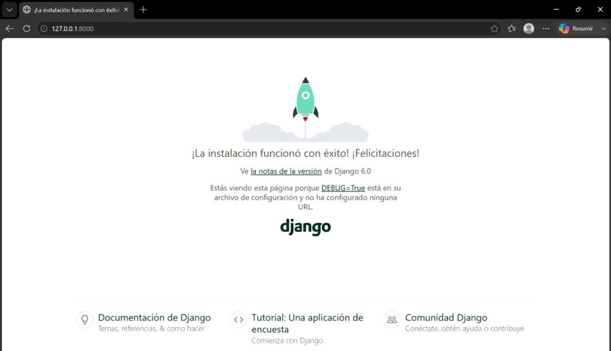

# Proyecto Backend Django - Aplicación de Notas

**Estudiantes** Francisco Solís, Jorge Patiño, Miguel Velastegui, Allison Olea, Luis Freire 
**Carrera:** Ingeniería en Software
**Semestre:** 4to semestre

---

## Documentación Técnica (Resumen de pasos realizados)

Durante el desarrollo de esta práctica de Programación Orientada a Objetos, implementé un monolito utilizando la arquitectura MVT (Modelo-Vista-Template) de Django. A continuación, detallo el flujo de trabajo realizado:

1. **Configuración del Entorno y Base de Datos:** se inicializo un entorno virtual (`.venv`) e instalé las dependencias necesarias. Configuré el proyecto para conectarse a una base de datos MySQL local mediante la librería `mysqlclient` y protegí las credenciales usando variables de entorno (`.env`).
   
2. **Modularización del Proyecto:** se creo dos aplicaiones principales:
   * `accounts`: encargada de la autenticación.
   * `core`: encargada de la lógica de negocio (notas).

3. **Implementación de Usuario Personalizado:** Aplicando conceptos de POO, extendí `AbstractBaseUser` y construí un `CustomUserManager` para modificar el comportamiento por defecto de Django, logrando que el inicio de sesión del sistema se realice con el **correo electrónico** en lugar del *username*.

4. **Desarrollo del CRUD de Notas:** El modelo `Note` estableciendo una relación de uno a muchos con el usuario autenticado. Posteriormente, utilicé Vistas Basadas en Clases (CBV) como `ListView`, `CreateView` y `DeleteView` para manejar la lógica de listar, guardar y eliminar registros, asegurando que cada usuario interactúe únicamente con su propia información.

5. **Diseño de Vistas y Enrutamiento:** se construyo las interfaz grafica (Login, Registro y Dashboard) utilizando HTML y **Bootstrap 5**. Empleé la herencia de plantillas a través de un archivo `base.html` para el *Navbar* y resolví los *namespaces* en `urls.py` para asegurar un redireccionamiento fluido post-autenticación.
---

## Evidencia de Ejecución

A continuación, se adjunta la captura del servidor de desarrollo corriendo exitosamente en `http://127.0.0.1:8000/`:
